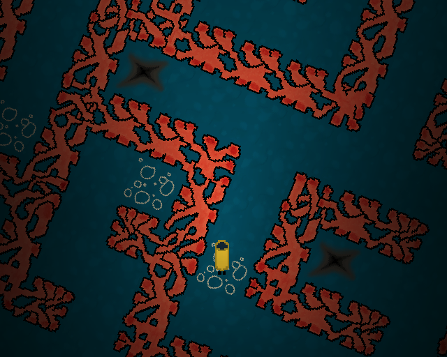

# lost-in-the-reef

A 2D puzzle game created by @GeroVeni and myself for the 2021 [Ludum Dare 48](https://ldjam.com/) game jam based on the theme "Deeper and deeper".

## Try it out

A WebGL version of the game is available at: https://michael-jb.github.io/lost-in-the-reef/.

You can also build the game yourself. To do this, open the `LostInTheReef/` directory in Unity at version 2021.1.4f1.

## The game

### Objective

The Ocean Exploration and Research Society (OERS) have discovered an underwater coral labyrinth. Scans of the sea bed have revealed that there is an artefact of great power hidden within, and as expedition leader your job is to locate and retrieve it.

The artefact is located in the deepest part of the labyrinth, where the pressure is greatest. You should keep your oxygen levels from depleting by entering pockets of air.

### Controls

| Key   | Action                      |
| ----- | --------------------------- |
| Q / E | Rotate left / right         |
| W / S | Propel forwards / backwards |
| Space | Interact                    |
| Esc   | Return to main menu         |

## Built with

- [Unity](https://unity.com/) - Game Engine
- [Gimp](https://www.gimp.org/) - Artwork
- [LMMS](https://lmms.io/) - Music
- [GitHub Pages](https://pages.github.com/) - Static Hosting

## License

[MIT license](./LICENSE)
